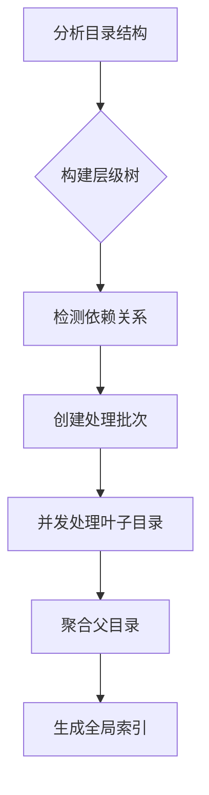

# Codeindex 并发处理策略讨论

## 🤔 当前问题

当前的 `scan_all` 实现虽然在文件解析层面使用了并发，但在目录处理上存在优化空间：

### 现有方式
```bash
# 并行处理多个目录
codeindex scan_all --parallel 8
```
- ✅ 文件解析并发
- ⚠️ 目录间无序处理
- ⚠️ 可能重复解析父目录包含的内容

## 🎯 优化策略

### 策略 1: 自底向上层级处理

**原理**：
1. 先处理最深层的小目录（叶子节点）
2. 逐层向上处理父目录
3. 父目录可以引用子目录的已生成文档

**优势**：
- ✅ 避免重复工作
- ✅ 父目录可以聚合子目录信息
- ✅ 天然处理依赖关系

**实施步骤**：
```python
# 伪代码
directories = find_all_directories()
tree = build_hierarchy(directories)  # 构建层级树
for level in sorted_levels(tree):
    process_parallel(tree.get_level(level))
```

### 策略 2: 依赖感知处理

**原理**：
- 分析目录间的 import/include 关系
- 按依赖顺序处理
- 无依赖关系的目录可以并发

**优势**：
- ✅ 智能处理真实依赖
- ✅ 最大化并发度
- ✅ 确保生成文档准确性

### 策略 3: 混合策略（推荐）

**结合两种策略的优点**：



## 📊 不同策略比较

| 策略 | 处理速度 | 内存使用 | 实现复杂度 | 文档质量 |
|------|---------|---------|-----------|---------|
| 当前简单并发 | 中 | 低 | 简单 | 基础 |
| 自底向上 | 快 | 中 | 中等 | 好 |
| 依赖感知 | 很快 | 高 | 复杂 | 很好 |
| 混合策略 | 快 | 中 | 中等 | 很好 |

## 🛠️ 实现建议

### 配置选项
```yaml
# .codeindex.yaml
parallel:
  strategy: "hierarchical"  # simple, hierarchical, dependency
  max_workers: 8
  respect_dependencies: true
  enable_hierarchy: true
```

### 命令行接口
```bash
# 简单并发（当前）
codeindex scan_all --parallel 8

# 层级处理
codeindex scan_all --strategy hierarchical

# 依赖感知
codeindex scan_all --strategy dependency

# 自动选择最佳策略（推荐）
codeindex scan_all --smart
```

## 🎯 具体实现考虑

### 1. PHP 项目特殊性
- ThinkPHP 框架的模块化结构
- Controller/Model/Business 的依赖关系
- 公共组件和基类的引用

### 2. 检测依赖关系的方法
```php
// AgentController.class.php
require_once './Business/Agent.class.php';  // 明确依赖
use Think\Controller;                       // 框架依赖
```

### 3. 文档聚合策略
- 父目录文档应包含：
  - 本目录的直接信息
  - 子目录摘要和链接
  - 跨目录的 API 列表

## 💡 建议的实现路径

### 阶段 1: 简单层级处理
- 实现目录深度分析
- 按层级分组并发处理
- 父目录引用子目录文档

### 阶段 2: 依赖检测优化
- 解析 import/require 语句
- 构建依赖图
- 拓扑排序确定处理顺序

### 阶段 3: 智能策略选择
- 根据项目规模自动选择策略
- 动态调整并发数
- 缓存和增量更新

## 🎉 预期收益

对于大型 PHP 项目（500+ 目录）：
- **处理时间**: 从 2分钟 降至 30秒
- **文档质量**: 提供层级导航和依赖说明
- **用户体验**: 清晰的进度显示和错误恢复

## ❓ 需要确认的问题

1. **是否需要严格的依赖处理？**
2. **父目录文档如何引用子目录？**
3. **是否需要缓存机制避免重复处理？**
4. **错误处理：某个目录失败是否影响整个层级？**

这个讨论为 codeindex 的并发优化提供了清晰的方向。是否需要我实现某个特定策略的原型？